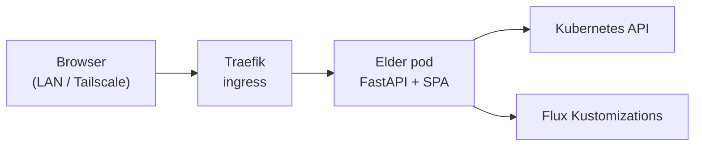

# Eldertree Control Center

Live ops console for the homelab cluster: OSI-layered topology, workload health, Grafana links, and runbook index. **LAN / Tailscale only** — not exposed on the public internet.

## URLs

| Environment | URL | Notes |
|-------------|-----|--------|
| Cluster (LAN) | `https://control.eldertree.local` | Traefik ingress → Elder service `:8000` |
| Elder API (same host) | `https://control.eldertree.local/api/public/cluster/health` | JSON health payload |
| Elder API (alternate) | `https://elder.eldertree.local` | Same backend; Swagger at `/docs` |
| Local dev (SPA) | `http://localhost:5174` | `cd elder/frontend && npm run dev` (proxies API to Elder `:8006`) |

Add `control.eldertree.local` to `/etc/hosts` or Pi-hole (see [`eldertree-local-hosts-block.txt`](eldertree-local-hosts-block.txt)) and optional Caddy proxy ([`scripts/Caddyfile`](../scripts/Caddyfile)).

## Architecture



- **Frontend:** React SPA in [elder/frontend](https://github.com/raolivei/elder/tree/main/frontend) — built into the Elder Docker image and served at `/`.
- **Backend:** [Elder](https://github.com/raolivei/elder) — `GET /api/public/cluster/health` (no API key; CORS restricted to trusted origins).
- **GitOps:** Ingress `control-center` in [`clusters/eldertree/openclaw/helmrelease.yaml`](../clusters/eldertree/openclaw/helmrelease.yaml); image `ghcr.io/raolivei/elder` (see OpenClaw HelmRelease `elder` values).

## Features

| Feature | Source |
|---------|--------|
| Node Ready status | K8s nodes API |
| Component health (Deployments/StatefulSets) | `list_component_health()` catalog |
| Flux readiness counts | Flux Kustomization status |
| Topology (OSI lanes, dependency links) | Frontend catalog + health poll |
| Health colors | 30s poll; green / amber / red / grey |
| Grafana deep links | Panel → `grafana.eldertree.xyz` |
| Runbooks | Static index → [eldertree-docs](https://docs.eldertree.xyz/runbook/) |

## API

Full schema and CORS policy: [elder/docs/PUBLIC_CLUSTER_API.md](https://github.com/raolivei/elder/blob/main/docs/PUBLIC_CLUSTER_API.md)

Quick check:

```bash
curl -sS https://control.eldertree.local/api/public/cluster/health | jq '{updated, flux: "\(.flux_ready)/\(.flux_total)", down: [.components[] | select(.status == "down" or .status == "degraded") | .id]}'
```

## Related consumers

| Site | Endpoint | Purpose |
|------|----------|---------|
| Control Center | `/api/public/cluster/health` | Full topology health |
| Blog / docs home widgets | `/api/public/cluster/nodes` | Node glance only |
| Blog (public GitHub Pages) | `/cluster-status.json` | Build-time snapshot when Elder unreachable |

Narrative write-up: [Building Eldertree — Chapter 21](https://blog.eldertree.xyz/chapters/21-the-control-center-because-i-needed-to-know-from-afar).

## Troubleshooting

| Symptom | Check |
|---------|--------|
| HTTP 503 | `kubectl get pods -n openclaw -l app=elder`; Elder endpoints empty → image pull or crash |
| All grey components | RBAC or wrong Deployment names in Elder catalog |
| DNS fails | `control.eldertree.local` in hosts/Pi-hole; external-dns annotation on ingress |
| CORS error from dev | Elder `debug=true` or add origin in `PUBLIC_CORS_ORIGINS` |

```bash
export KUBECONFIG=~/.kube/config-eldertree
kubectl get ingress control-center -n openclaw
kubectl get deploy elder -n openclaw
kubectl logs -n openclaw deploy/elder --tail=50
flux reconcile helmrelease openclaw -n openclaw
```
