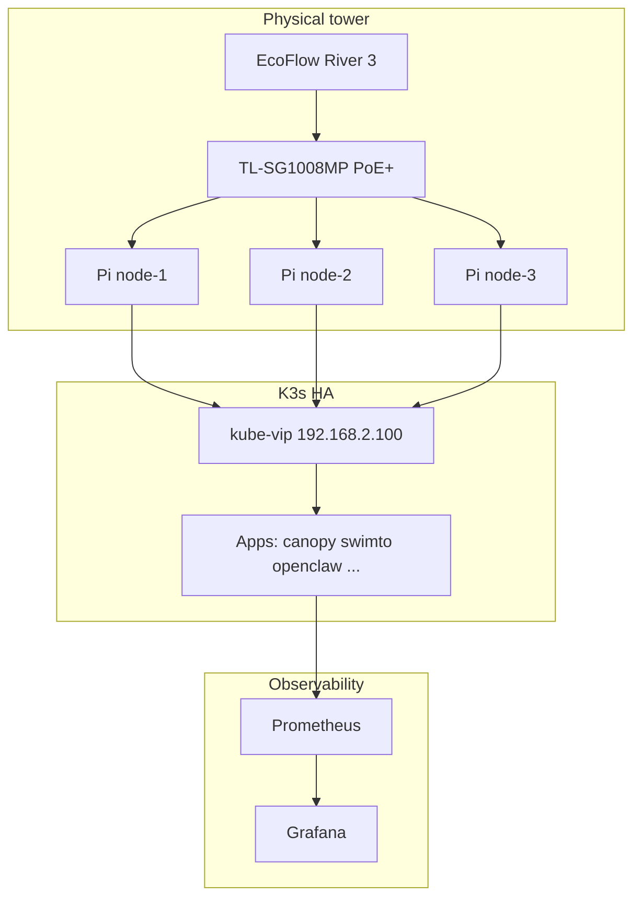

# ElderTree cluster — project hub

Single map for the **eldertree** edge cluster: hardware, software repos, live dashboards, and docs.

## See it live

| What | URL / command |
|------|----------------|
| **Ops home (Grafana)** | https://grafana.eldertree.local/d/eldertree-ops-home |
| **Cluster overview** | https://grafana.eldertree.local/d/eldertree-cluster |
| **Hardware health (Pis)** | https://grafana.eldertree.local/d/hardware-health |
| **Runbook + project page** | https://docs.eldertree.xyz/project |
| **Open dashboards + status** | `./scripts/operations/eldertree-open.sh` |

```bash
export KUBECONFIG=~/.kube/config-eldertree
kubectl get nodes -o wide
kubectl get pods -A | grep -v Running | grep -v Completed || true
```

## Repositories

| Repo | Role |
|------|------|
| [pi-fleet](https://github.com/raolivei/pi-fleet) | K3s, Ansible, Terraform, FluxCD, monitoring |
| [eldertree-chassis](https://github.com/raolivei/eldertree-chassis) | OpenSCAD tower, BOM, prints (private) |
| [eldertree-docs](https://github.com/raolivei/eldertree-docs) | Runbook (public + local) |

## Physical + compute

See [HARDWARE_CHASSIS.md](HARDWARE_CHASSIS.md) and [eldertree-chassis](https://github.com/raolivei/eldertree-chassis).

| Layer | Component |
|-------|-----------|
| Base | EcoFlow River 3 |
| Network | TP-Link TL-SG1008MP (PoE+) |
| Nodes | 3× Pi 5 (8GB), NVMe + PoE+ HAT |

## Nodes

| Node | wlan0 | eth0 (cluster) | Hostname |
|------|-------|----------------|----------|
| node-1 | 192.168.2.101 | 10.0.0.1 | node-1.eldertree.local |
| node-2 | 192.168.2.102 | 10.0.0.2 | node-2.eldertree.local |
| node-3 | 192.168.2.103 | 10.0.0.3 | node-3.eldertree.local |

**VIP:** API `192.168.2.100` · Ingress `192.168.2.200` · DNS `192.168.2.201`

## Architecture



## Key local services

| Service | URL |
|---------|-----|
| Grafana | https://grafana.eldertree.local |
| Prometheus | https://prometheus.eldertree.local |
| Vault | https://vault.eldertree.local |
| Pi-hole | https://pihole.eldertree.local |
| OpenClaw | https://openclaw.eldertree.local |

Full service list: [clusters/eldertree/openclaw/docs/ELDERTREE_KNOWLEDGE.md](../clusters/eldertree/openclaw/docs/ELDERTREE_KNOWLEDGE.md).

## More reading

- [NETWORK.md](../NETWORK.md) — IPs and VIPs
- [GIGABIT_NETWORK_SETUP.md](GIGABIT_NETWORK_SETUP.md) — eth0 isolated switch
- [helm/monitoring-stack/DASHBOARDS.md](../helm/monitoring-stack/DASHBOARDS.md) — Grafana UIDs
- [runbook: chassis assembly](https://docs.eldertree.xyz/runbook/hardware/chassis)
