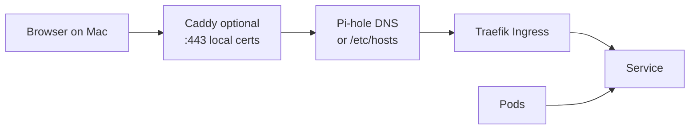

# Onboarding a new Eldertree app — routing & access (end-to-end)

When a new service deploys but **does not load on your Mac**, the failure is rarely one thing. Traffic crosses several layers; skipping any of them breaks “it works in the cluster” vs “it works in my browser.”

**Goal:** Every new LAN-facing app passes `./scripts/verify-service-routing.sh --host <fqdn>` before the PR merges.

Related: [ONBOARDING_APP_OBSERVABILITY.md](ONBOARDING_APP_OBSERVABILITY.md) (metrics/Grafana) · [INGRESS.md](INGRESS.md) (Traefik/cert-manager/external-dns details)

---

## The path a request takes



**Cluster-only fixes** (Ingress, pods) do not help if **Pi-hole**, **/etc/hosts**, or **Caddy** on the Mac are stale. That is why routing changes often feel like whack-a-mole.

---

## Single source of truth

**[`docs/eldertree-local-services.yaml`](eldertree-local-services.yaml)** — canonical list of `*.eldertree.local` hostnames.

When adding a service, **register the host here first**, then update the other files (or run the sync checker until green).

Enforced copies (must list every registry host):

| File | Purpose |
|------|---------|
| [`docs/eldertree-local-hosts-block.txt`](eldertree-local-hosts-block.txt) | Tailscale / manual `/etc/hosts` block |
| [`scripts/add-services-to-hosts.sh`](../scripts/add-services-to-hosts.sh) | `sudo` helper to append hosts |
| [`scripts/Caddyfile`](../scripts/Caddyfile) | Local HTTPS proxy → Traefik NodePort (when not using Pi-hole-only) |

Also update [`docs/SERVICES_REFERENCE.md`](SERVICES_REFERENCE.md) for humans.

---

## Checklist (single pi-fleet PR + app PR if needed)

### A. Cluster (GitOps)

- [ ] **Deployment / StatefulSet** Ready; **Service** exists
- [ ] **Ingress** (or `eldertree-app` HelmRelease `ingress:`) with:
  - `host: <app>.eldertree.local`
  - `ingressClassName: traefik`
  - TLS + `cert-manager.io/cluster-issuer: ca-cluster-issuer` (or chart default)
  - **`external-dns.alpha.kubernetes.io/hostname: <app>.eldertree.local`**
- [ ] Backend **Service name and port** match Ingress (typo = 503)
- [ ] App **CORS / allowedOrigins** includes `https://<app>.eldertree.local` if browser-facing API
- [ ] Flux reconcile (or wait for interval):

```bash
export KUBECONFIG=~/.kube/config-eldertree
flux reconcile source git flux-system -n flux-system
flux reconcile kustomization flux-system -n flux-system --timeout=5m
```

### B. Mac / LAN routing (same PR when LAN-facing)

- [ ] Add host to **`docs/eldertree-local-services.yaml`**
- [ ] Add line to **`docs/eldertree-local-hosts-block.txt`**
- [ ] Add line to **`scripts/add-services-to-hosts.sh`**
- [ ] Add Caddy block to **`scripts/Caddyfile`** (copy `elder.eldertree.local` stanza; change hostname)
- [ ] If using hosts-only: `sudo ./scripts/add-services-to-hosts.sh` on Mac
- [ ] If using Caddy: reload Caddy after editing Caddyfile

### C. Verify (automated)

```bash
cd pi-fleet

# 1. Repo files in sync (no cluster needed)
./scripts/check-local-routing-registry.sh

# 2. End-to-end (cluster + Pi-hole + Mac)
export KUBECONFIG=~/.kube/config-eldertree
./scripts/verify-service-routing.sh --host <app>.eldertree.local
```

**Interpretation:**

| Failed check | Likely fix |
|--------------|------------|
| No Ingress | GitOps not applied; Flux stuck; wrong namespace |
| No endpoints | Image pull, crash loop, wrong selector |
| Certificate not Ready | cert-manager issuer, DNS-01/CA config |
| Pi-hole NXDOMAIN | external-dns annotation; external-dns logs |
| Traefik NodePort OK, Mac curl fail | hosts/Caddy/DNS on Mac |
| Mac 503, Traefik 503 | Backend down (not a routing issue) |
| Missing from Caddyfile | Run registry sync; add stanza |

Cluster-only debug (bypasses Mac):

```bash
curl -sk --resolve "<app>.eldertree.local:443:192.168.2.101" https://<app>.eldertree.local/
```

### D. Optional but recommended

- [ ] **Blackbox** probe in `helm/monitoring-stack/values.yaml` (`blackbox-https-ca` for `*.eldertree.local`)
- [ ] **Control Center** catalog in `elder` if the app should appear on the topology ([`ONBOARDING_APP_OBSERVABILITY.md`](ONBOARDING_APP_OBSERVABILITY.md) + Elder `COMPONENT_TARGETS`)
- [ ] **Public URL** only if needed: Cloudflare Tunnel rule in `terraform/cloudflare.tf` (separate from LAN path)

---

## Public vs LAN

| Access | Mechanism | Verify with |
|--------|-----------|-------------|
| **LAN / Tailscale** | Traefik + Pi-hole + hosts/Caddy | `verify-service-routing.sh` |
| **Public HTTPS** | Cloudflare Tunnel → Traefik ClusterIP | Blackbox `blackbox-https` job; browser off-LAN |

Do not assume LAN routing implies public URL or vice versa.

---

## Helm (`eldertree-app`) example

```yaml
ingress:
  web:
    host: myapp.eldertree.local
    service: myapp-web
    port: 8080
    tls:
      secretName: myapp-tls
      certManager: true
    annotations:
      external-dns.alpha.kubernetes.io/hostname: myapp.eldertree.local
```

Then complete section **B** and run **C**.

---

## When something else breaks after a routing change

1. Run **`./scripts/verify-service-routing.sh --all-local`** — find regressions across all services
2. Run **`./scripts/check-local-routing-registry.sh`** — catch files out of sync
3. Check **`flux get kustomization flux-system`** — one bad manifest blocks everything
4. Prefer **additive** PRs (new host in all sync files) over editing shared Traefik middleware unless intentional

---

## Quick reference

```bash
# Registry sync only
./scripts/check-local-routing-registry.sh --fix-hints

# One new service after deploy
./scripts/verify-service-routing.sh --host myapp.eldertree.local

# Full regression sweep (e.g. after Caddy/hosts bulk edit)
./scripts/verify-service-routing.sh --all-local
```

Memory: `ollie/memory/pifleet_service_routing_onboarding.md`
